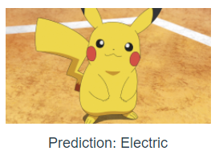

# PokemonTypesCNNWeb

A website for demonstrating the Convolutional Neural Network (CNN) trained for the
[PokemonTypesCNN](https://github.com/AnTuanHa/PokemonTypesCNN) project.

The static webpage is available [here](https://antuanha.github.io/PokemonTypesCNN/)



## Project setup
```
npm install
```

### Compiles and hot-reloads for development
```
npm run serve
```

### Compiles and minifies for production
```
npm run build
```

### Lints and fixes files
```
npm run lint
```

### Customize configuration
See [Configuration Reference](https://cli.vuejs.org/config/).
